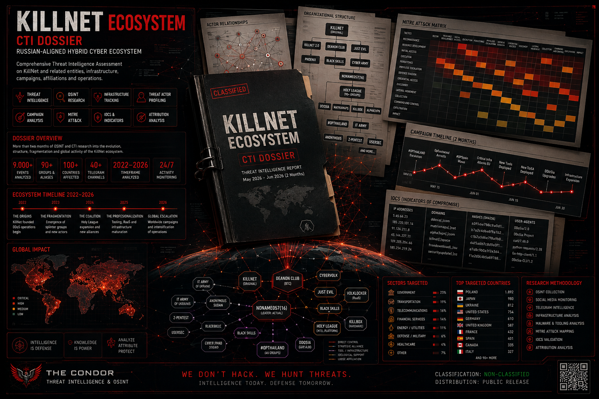
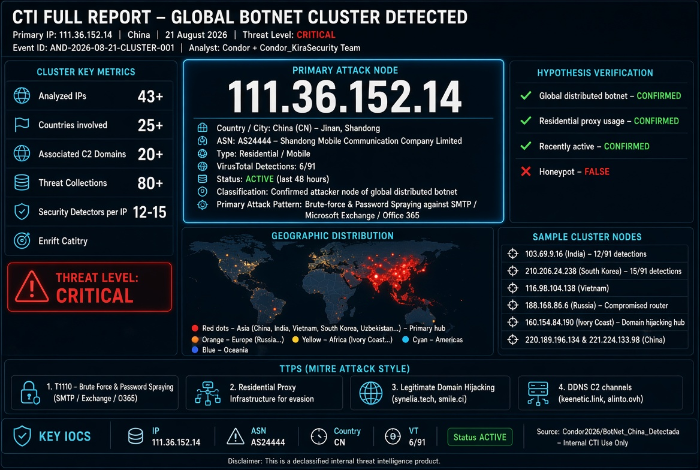

# 🛡️ Condor2026 - ClearWhiteNet — CTI / OSINT / Threat Intelligence Repository

 

**Análisis narrativo de amenazas · Inteligencia de fuentes abiertas · Herramientas defensivas y de OSINT PASIVO**

[Descripción](#-descripción) · [Contenido](#-contenido-del-repositorio) · [Uso](#-cómo-usar-este-repositorio) · [Licencia](#-licencia) · [Disclaimer](#-disclaimer)

---

## 📌 Descripción

Este repositorio constituye el **archivo central de inteligencia de amenazas**
de **Condor2026**, un proyecto independiente dedicado al análisis de
cibercriminalidad, hacktivismo, APTs y amenazas emergentes, con un enfoque
estrictamente **defensivo, legal y ético**.

El contenido se nutre de **fuentes públicas**, canales de Telegram, foros,
darknet y reportes de terceros, y se transforma en **inteligencia accionable**
para equipos SOC, Blue Team, analistas CTI y profesionales de ciberseguridad.

> **Filosofía del proyecto:** *"La luz pública es el mejor desinfectante."*
> Conocer las TTPs de los atacantes es el primer paso para defenderse de ellos.

---

## 📦 Contenido del repositorio

Este repositorio contiene **37 proyectos** empaquetados en `repos.zip`.
Cada proyecto mantiene su propia estructura, licencia y documentación interna.

### 🧠 Informes CTI / OSINT
Análisis narrativo profundo de grupos APT, hacktivistas, r4nsomware,
supply chain, sector salud, energía, cibercrimen financiero y
actores nation-state. Incluye IOCs, TTPs, contexto geopolítico y
evaluación de riesgo.

### 🛠️ Herramientas defensivas (Tools)
Scripts y utilidades desarrolladas por Condor2026 para:
- Recolección OSINT
- Extracción y enriquecimiento de IOCs
- Mapeo automático a MITRE ATT&CK
- Análisis de infraestructura maliciosa
- Generación de feeds para SIEM/EDR

### 📚 Manuales y guías técnicas
Documentación práctica sobre:
- Análisis de malware
- OSINT avanzado
- Defensa ante APTs
- Respuesta a incidentes
- Threat hunting

### 📡 IOCs y recursos
- Indicadores de compromiso consolidados (CSV / JSON / TXT)
- Cheatsheets de análisis
- Enlaces a fuentes OSINT verificadas
- Mapeos MITRE ATT&CK

---

## 🚀 Cómo usar este repositorio

Solo necesitas **tres pasos**:

1. **Descarga** el archivo `repos.zip`
   → Botón **"Download"** en la parte superior derecha del archivo.
2. **Descomprímelo** en tu ordenador
   → Clic derecho → *Extraer aquí* (o usa `unzip repos.zip`).
3. **Explora** las 37 carpetas resultantes
   → Cada una contiene su propio `README.md`, `LICENSE` y estructura.

> No necesitas clonar, ni instalar dependencias, ni configurar nada.
> Descargar → descomprimir → usar.

---

## 🎯 Enfoque y principios

| Principio | Descripción |
|---|---|
| **Legalidad** | 100% conforme a la legislación vigente |
| **Ética** | Enfoque defensivo, nunca ofensivo |
| **Transparencia** | Fuentes públicas, metodología documentada |
| **Rigor** | Sin minimización, sin magnificación |
| **Utilidad** | Inteligencia accionable para defensores |
| **Neutralidad** | Sin sesgo político, militar o empresarial |

---

## 🧩 Categorías de amenazas cubiertas

- **APT / Nation-State** — APT28, Kimsuky, Lazarus, Webworm, OceanLotus, MuddyWater, Mustang Panda, Nimbus Manticore
- **Hacktivismo prorruso** — KillNet, UserSec, NoName057(16), Russian Legion, Cyber Serp, Beregini, Shadow ClawZ 404
- **Ransomware** — ShinyHunters, The Gentlemen, Play, Conti, Qilin, RansomHub, Akira
- **Supply Chain** — TeamPCP, Mini Shai-Hulud, Laravel-Lang, Ghost CMS, Drupal, Exim
- **Cibercrimen financiero** — Zippay, World of Shells, PetrusNism
- **Sector salud** — Hospitales Dinamarca, Tailandia, Ucrania, EE.UU.
- **Sector energía** — 120K UPS, ICS/SCADA, redes eléctricas
- **DDoS / Botnets** — DDoSia, CoupTeam, Keymous Plus

---

## 📜 Licencia

Este repositorio utiliza **licencia dual** según el tipo de contenido:

| Contenido | Licencia | Uso comercial |
|---|---|---|
| Informes, manuales, documentación | **CC BY 4.0** | ✅ Sí, con atribución |
| Herramientas, scripts, código | **MIT** | ✅ Sí, sin restricciones |

Ver [`LICENSE`](LICENSE) para el texto completo.

---

## ⚠️ Disclaimer

Este repositorio contiene **inteligencia de amenazas recopilada de fuentes
públicas**. Su uso es exclusivamente **defensivo, educativo y de
investigación**.

El autor **no se hace responsable** del mal uso de la información aquí
contenida. Ver [`DISCLAIMER.md`](DISCLAIMER.md) para la declinación
completa de responsabilidad.

---

## 🔐 Seguridad y reportes

Para reportar:
- Errores factuales
- IOCs incorrectos o desactualizados
- Atribuciones erróneas
- Datos personales (PII) que deban retirarse
- Vulnerabilidades en las tools

Consulta [`SECURITY.md`](SECURITY.md) para el procedimiento.

**NO abras issues públicos** para temas sensibles. Usa issues confidenciales.

---

## 📅 Historial de versiones

Ver [`CHANGELOG.md`](CHANGELOG.md) para el historial completo.

---

## 👤 Autor

**Condor - ClearWhiteNet**
Analista CTI / OSINT independiente
Enfoque: cibercrimen, hacktivismo, APTs, defensa Blue Team

---

## 🤝 Contribuciones

Este es un proyecto personal de investigación. Las contribuciones,
correcciones y aportes son bienvenidos siempre que respeten:

- El enfoque **defensivo y ético**
- La **legalidad** vigente
- La **neutralidad** política
- La **atribución** correcta

---

**© 2026 Condor2026 - ClearWhiteNet — CC BY 4.0 / MIT**

*"La luz pública es el mejor desinfectante."*

